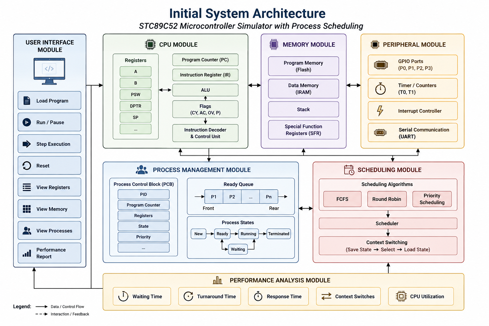

# 🚀 Educational Microcontroller Simulator with Process Scheduling

«A simple educational simulator for the STC89C52 8-bit Microcontroller»

---

📌 **About The Project**

This project is an educational simulator for the STC89C52 8-bit microcontroller.

The main aim of this project is to understand how a microcontroller execute instructions, use memory and manage multiple programs.

**This project combines:**

- Microprocessor Architecture
- Data Structures
- Operating Systems

---

🎯 **Problem Objective**

The main objective is to develop a simple software-based simulator that helps students understand the working of the STC89C52 along with basic process management and CPU scheduling concepts.

---

🎯 **Problem Statement**

We are planning to develop a software based simulator for the STC89C52 microcontroller.

The simulator will focus on basic processor components like:

- CPU & Registers
- Program Counter (PC)
- Flags
- Program Memory
- Data Memory
- Stack
- Instruction Execution

The project will also study Process Management and CPU Scheduling concepts.

---

📦 **Project Scope**

The project will cover:

- CPU and Register operations
- Program and Data Memory
- Stack operations
- Instruction Execution
- GPIO, Timer and Interrupts
- Process Management
- Process Control Block (PCB)
- Ready Queue
- Context Switching
- FCFS Scheduling
- Round Robin Scheduling
- Priority Scheduling
- Performance Analysis

---

⚙️ **Microcontroller Being Simulated**

**STC89C52 – 8-bit 8051 compatible microcontroller**

The simulator will represent the main components required for educational purposes, rather than implementing the complete hardware of the microcontroller.

---

💻 **Selected Programming Language**

**Java**

Java is selected as the programming language for this project because it supports Object-Oriented Programming and provides suitable data structures for implementing the CPU, memory, processes, PCB, scheduling algorithms and user interface.

---

🔧 **Planned Concepts**

The simulator is planned to include:

- Instruction Execution
- Memory & Stack
- GPIO
- Timer
- Interrupts
- Process Management
- Process Control Block (PCB)
- Ready Queue
- Context Switching
- FCFS Scheduling
- Round Robin Scheduling
- Priority Scheduling

---

🏗️ **Initial System Architecture**

The initial system architecture consists of different modules that work together to simulate the microcontroller, processes and CPU scheduling.

The architecture includes the CPU, memory, peripherals, process management, scheduling and performance analysis modules along with the user interface.

---

📊 **Performance Analysis**

The project is planned to analyse:

- Waiting Time
- Turnaround Time
- Response Time
- Context Switches
- CPU Utilization

---

👨‍💻 **Developers**

<table>
<tr><td align="center">
 
<b>Izhan</b>
</td><td align="center">
 
<b>Keora</b>
</td><td align="center">
 
<b>Punarvi</b>
</td><td align="center">
 
<b>Hisham</b>
</td></tr>
</table>

---

👥 **Team Responsibilities**

- **Izhan:** OS Scheduling & Simulator Planning
- **Keora:** Data Structures & Process Management
- **Punarvi:** Memory & Stack Study
- **Hisham:** STC89C52 CPU / Architecture Study

**Secondary Responsibilities:**

- **Izhan:** UI Design
- **Keora:** Testing Plan
- **Punarvi:** Architecture Diagram
- **Hisham:** GitHub & Project Integration

---

📅 **Initial Development Plan**

### Week 1 – Planning & Research

- Study STC89C52 architecture
- Study CPU, memory and stack
- Study process management and scheduling
- Finalize system architecture
- Set up GitHub project

---

🌱 **Goal**

The goal of this project is to make a simple simulator which helps students understand how the STC89C52 works and how multiple programs can be managed using CPU Scheduling.

The project will be developed step by step in the coming weeks.

---

🚧 **Project Status**

**Currently in the Initial Development / Planning Stage.**

More features and implementation details will be added as development progresses.
